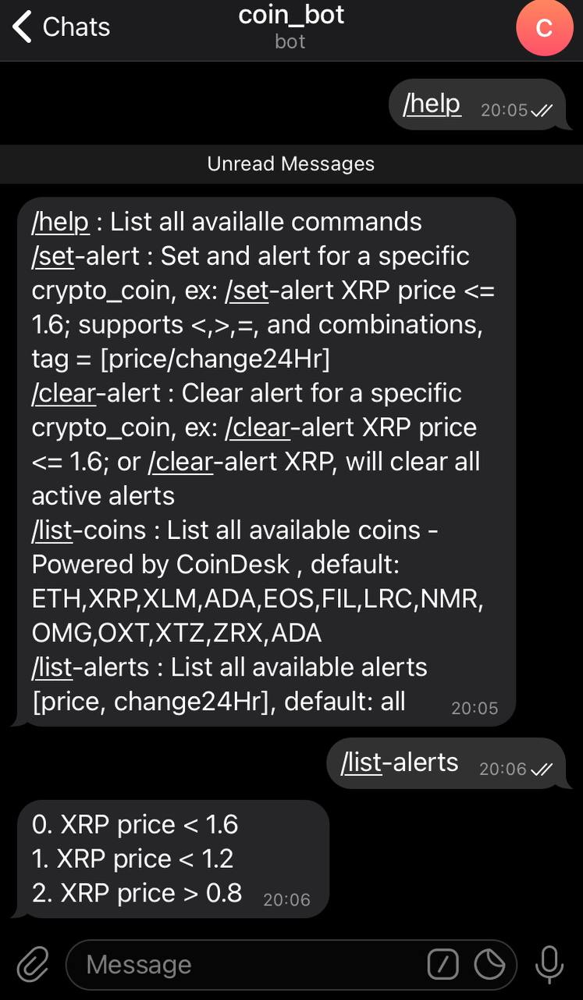
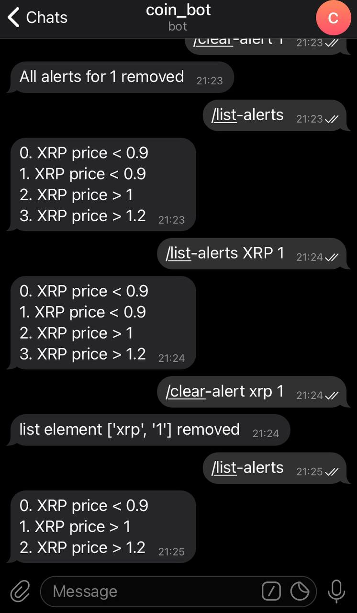
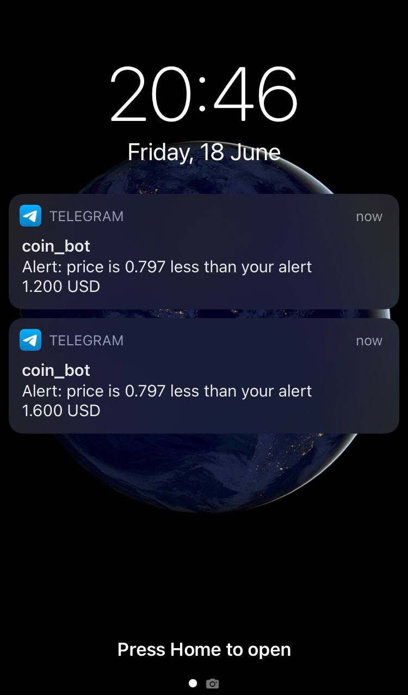

# Crypto coin telegram bot

This application provides an interface through telegram application to inspect crypto coin-related information from CoinDesk [1] and set notifications if a specific coin price reaches a certain value of interest. It is ideal to be placed on a Raspberry Pi [5] or a home automation system for periodical checking of the crypto values.

By default the following crypto currenchies are listed: ETH,XRP,XLM,ADA,EOS,FIL,LRC,NMR,OMG,OXT,XTZ,ZRX,ADA

<p align="center"> 
  </a>
  </a>
  </a>
</p>


## How to use

First, a telegram bot is needed to be created, to respond to our commands [4,3]. During the creation process, a unique TOKEN will be generated together with an ID. This information is needed for the application configuration. Use the command line arguments to introduce these parameters.

The following command-line arguments are available:

```
Powered by CoinDesk, https://www.coindesk.com/
usage: crypto_telegram_bot.py [-h] [-f F] [-cl CL] [-t T] [-id ID]

Telegram bot for crypto coin information. Checks and triggers notifications
based on the settled alerts.

optional arguments:
  -h, --help  show this help message and exit
  -f F        alert.json file location
  -cl CL      coin list, simple string file with the crypto acronym, i.e. XRP
  -t T        TOKEN received from the Telegram bot creation process
  -id ID      ID, received from the Telegram IDBot

```

Contributors are welcomed!

## Links

1. [CoinDesk API](https://www.coindesk.com/coindesk-api)

2. [Telegram API methods](https://core.telegram.org/bots/api#available-methods)
3. [creating a Telegram bot](https://core.telegram.org/bots#6-botfather)
4. [How to Create and Deploy a Telegram Bot using Python](https://djangostars.com/blog/how-to-create-and-deploy-a-telegram-bot/)
5. [Raspberry Pi](https://www.raspberrypi.org/)

/Enjoy.
